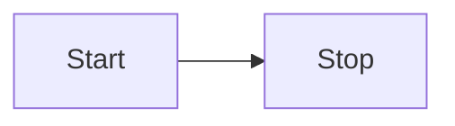

# Refcount

```python
import sys

obj = ["hello"]  # refcount = 1
```


```mermaid
flowchart LR
    obj --> list_hello
```

```
en_till_var = obj  # refcount = 2

print(sys.getrefcount(obj))  # refcount = 3, inne i sys.getrefcount()
```


```mermaid
flowchart LR
    Start --> Stop
```
