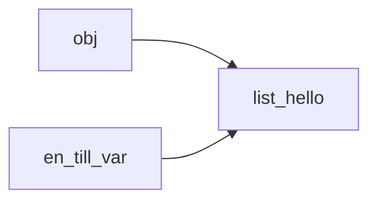
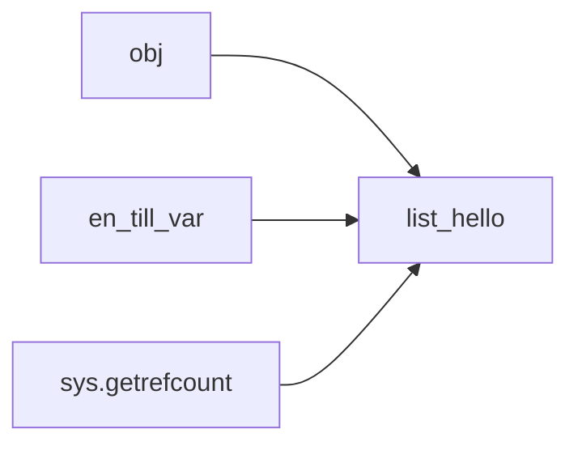
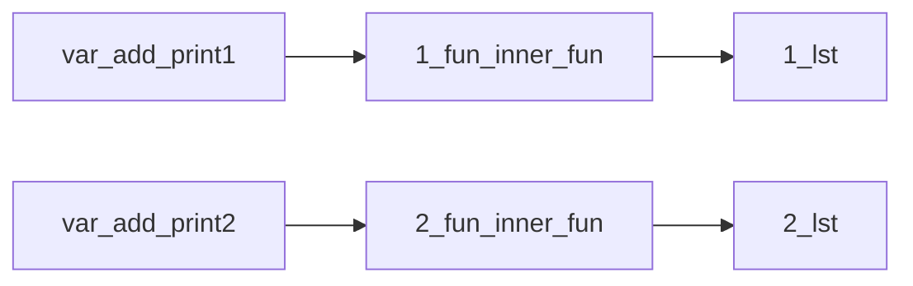

# Refcount och scope

# "Enkel" refcount

```python
import sys

obj = ["hello"]  # refcount = 1
```


```
en_till_var = obj  # refcount = 2
```


```
print(sys.getrefcount(obj))  # refcount = 3, inne i sys.getrefcount()
```



## Funktionsfabrik

```python
def fun_fac():
    lst = []

    def inner_fun(obj):
        lst.append(obj)
        print(lst)

    return inner_fun

add_print1 = fun_fac()
add_print2 = fun_fac()

# En fabrik som ger tillbaka kompletta och
# användbara funktioner
def fun_fac():
    lst = []

    def inner_fun(obj):
        lst.append(obj)
        print(lst)

    return inner_fun


add_print1 = fun_fac()
add_print2 = fun_fac()

add_print1("Hej")
add_print2("Hello")
add_print2("Super")
add_print2("Mario")
add_print2("World")
add_print1("Benny!")
```

### Referenser

Blir referenser enligt:

`lst` är nyskapad, likaså `fun_inner_fun`. Båda skapades av vår fabrik.

### Skapades och anropades


